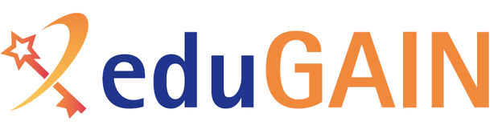
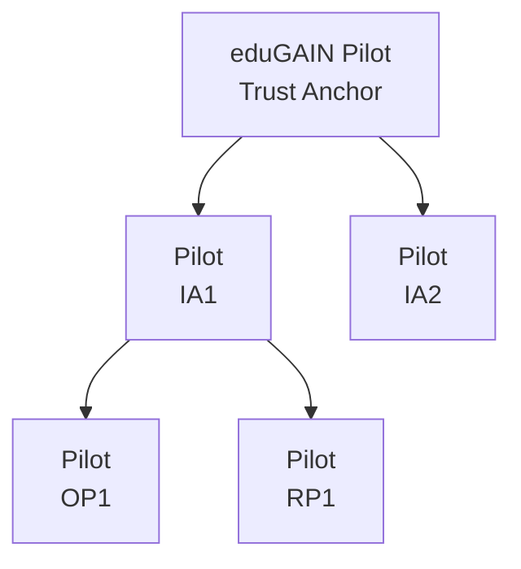

# eduGAIN OpenID Federation Pilot



This repository is dedicated to the eduGAIN OpenID Federation Pilot.

> eduGAIN is the interfederation service that connects identity federations around the world,
> simplifying access to content, services and resources for the global research and education
> community. eduGAIN comprises over 80 participant federations connecting more than 9,000
> Identity and Service Providers.

For more information about eduGAIN please visit:

- General information - eduGAIN main website: https://edugain.org
- Membership, entities, metadata - eduGAIN Tecnical site: https://technical.edugain.org
- Documentation, Meetings, Governance - the eduGAIN wiki: https://wiki.edugain.org

---

## Pilot environment

The pilot environment consists of the following elements:
- https://ta.oidf-pilot.edugain.org: the eduGAIN OpenID Federation Pilot Trust Anchor, based on the LightHouse OIDFed Trust Anchor (https://go-oidfed.github.io/offa/).  
- https://ia1.oidf-pilot.edugain.org: Intermediate Authority 1, which is an entity controlled by the pilot team that acts as a mock federation. It's a subordinate of the eduGAIN-TA based on the LightHouse OIDFed Trust Anchor.
- https://ia2.oidf-pilot.edugain.org: Intermediate Authority 2, which is an entity controlled by the pilot team that acts as a mock federation. It's a subordinate of the eduGAIN-TA based on the LightHouse OIDFed Trust Anchor.
- https://rp1.oidf-pilot.edugain.org: Relaying Party 1, which is an entity controlled by the pilot team offering a simple OIDFed Relaying Party. It's a subordinate of the Intermediate Authority 1. It's based on OFFA - Openid Federation Forward Auth (https://go-oidfed.github.io/offa/).




> [!NOTE]
> The pilot infrastructure is based on a series of docker instances. All the
> configuration files used to set up the dockers are available in the `pilot` directory
> (keys and running data excluded). 

## Pilot Participation

Pilot participation is reserved to current eduGAIN Participants as listed on the eduGAIN Members page, https://technical.edugain.org/status.
Of course, an eduGAIN Participant can nominate or aknowledge the participation of anyone on its behalf. 

### Requirements

In order to participate to the pilot, you should have set up your own OpenID Federation Trust Anchor (TA) that will be registered as a Subordinate Entity to the eduGAIN Trust Anchor. From the eduGAIN point of view, the participant 
Trust Anchor will be seen as an Intermediate Authority, which is the main term that will be used in this documentation. 

> [!IMPORTANT]  
> Please be aware that the current requirements are going to change in the course
> of the pilot as we introduce more functionalities and policy obligations.  

Intermediate Authorities must respect the following requirements:
- act as Trust Anchor for the entities of their federation.
- provide their own Entity Configuration at the `<ENTITY_IDENTIFIER> + /.well-known/openid-federation` endpoint.
- the Entity Configuration contains the following OpenID Federation metadata parameters:
  - `organization_name` matches the Organization Name already published as eduGAIN Participant.
  - `contacts` contains the technical email address of the federation.
  - `organization_uri` contains a URL pointing to the official Organizations' site.
- sign the Entity Configuration with the key provided to eduGAIN for the verification of authenticity (see Participation requests below). 
- expose the following endpoints:
  - `federation_fetch_endpoint` as described in [https://openid.net/specs/openid-federation-1_0.html#fetch_endpoint].
  - `federation_list_endpoint` as described in [https://openid.net/specs/openid-federation-1_0.html#entity_listing].
  - `federation_resolve_endpoint` as described in [https://openid.net/specs/openid-federation-1_0.html#name-resolve-entity]. The resolve endpoint MUST accept queries with the `trust_anchor` parameter equals to:
    - the Intermediate Authority.
    - the eduGAIN Trust Anchor.


### Participation requests

Requests for participation should be sent by the eduGAIN delegate or deputy to [<support@edugain.org>](mailto:support@edugain.org) with the following content:
- eduGAIN Participant name.
- The Entity Identifier of the Federation Trust Anchor.
- The Federation Trust Anchor public key in PEM format can be communicated in one of the following way:
  - sent as an attachment to the mail request if S/MIME signing is enabled with trusted (CAB/Forum) certificates, or
  - published on an HTTPS URL protected by trusted (CAB/Forum) certificates and pointing to the Federation Trust Anchor public key in PEM format. Please note that the HOST part of the URL is expected to insist on a domain in the remit of the organization.

### Federations set up

The eduGAIN pilot team will process each request with the following process:

1. Verify that the request is complete and the PEM key is valid.
2. Query the configuration endpoint to obtain the Entity Configuration of the Federation
Trust Anchor. The configuration endpoint is determined by concatenating the string 
`/.well-known/openid-federation` to the Entity Identifier.
3. Verify that the Entity Configuration is signed with the same key communicated in the request. 
4. Verify that the federation signing key contained in the Entity Configuration is the
same key communicated in the request.
5. Verify that the Federation Trust Anchor is compliant with all the requirements listed above.
6. If everything is ok, add the Federation Trust Anchor as a subordinate of the eduGAIN OIDF Pilot Trust Anchor.
7. Verify that a valid Trust Chain exists between the Federation Trust Anchor and other subordinates of the eduGAIN OIDF Pilot Trust Anchor.
8. Communicate to the requester that all is good and they've been officially on boarded to the pilot.

### eduGAIN Pilot Entities Configurations

Here you can find some example Entity Configurations provided by the current
eduGAIN OpenID Federation Pilot entities.

- eduGAIN OpenID Federation Pilot Trust Anchor - https://ta.oidf-pilot.edugain.org 

```
{
  "exp": 1752246223.7172408,
  "iat": 1752159823.7172408,
  "iss": "https://ta.oidf-pilot.edugain.org",
  "jwks": {
    "keys": [
      {
        "alg": "ES256",
        "crv": "P-256",
        "kid": "xcXdyJ2_7cOd05QIqfpdrb3j5-mYFw8dqdcqzEh0lUw",
        "kty": "EC",
        "use": "sig",
        "x": "hh5u_VrRXLaXNAdZX2CQWNAXFqgDCYhYGY1y1qbx9Q8",
        "y": "qNPeoZOuVv-I6e-oUt9imwV6TSt-ymTaaW2Mrlgo0JQ"
      }
    ]
  },
  "lighthouse_version": "0.5.1",
  "metadata": {
    "federation_entity": {
      "contacts": [
        "support@edugain.org"
      ],
      "display_name": "eduGAIN OIDF Pilot Trust Anchor",
      "federation_enroll_endpoint": "https://ta.oidf-pilot.edugain.org/enroll",
      "federation_fetch_endpoint": "https://ta.oidf-pilot.edugain.org/fetch",
      "federation_list_endpoint": "https://ta.oidf-pilot.edugain.org/list",
      "federation_resolve_endpoint": "https://ta.oidf-pilot.edugain.org/resolve",
      "organization_name": "eduGAIN",
      "organization_uri": "https://edugain.org"
    }
  },
  "sub": "https://ta.oidf-pilot.edugain.org"
}
```

- Intermediate Authority 2 - https://ia2.oidf-pilot.edugain.org

```
{
  "authority_hints": [
    "https://ta.oidf-pilot.edugain.org"
  ],
  "exp": 1752246518.9038033,
  "iat": 1752160118.9038033,
  "iss": "https://ia2.oidf-pilot.edugain.org",
  "jwks": {
    "keys": [
      {
        "alg": "ES512",
        "crv": "P-521",
        "kid": "V9BIFlN_TB-TTGggWcnRU_APfSjsi1MxwPBhvRz3Now",
        "kty": "EC",
        "use": "sig",
        "x": "AB6kKs3DH3SVNkLwrPHfwP1crdbfpYIyQxqQ5PloZzpGQXFj4fG5pWzYB5UgxanO0MtUHR-NZmKUJ_58ffvgBXNp",
        "y": "AcjpQWBsRJyE6Tf3Bw9Qg9H7eWwCV12zHtnB8T5TovHkud1D1qyjLmeq8rDeOHTielIqCTHZ70ErOrnxqqAWcFn5"
      }
    ]
  },
  "lighthouse_version": "0.5.1",
  "metadata": {
    "federation_entity": {
      "contacts": [
        "support@edugain.org"
      ],
      "display_name": "eduGAIN OIDF Pilot Intermediate Authority 2",
      "federation_enroll_endpoint": "https://ia2.oidf-pilot.edugain.org/enroll",
      "federation_fetch_endpoint": "https://ia2.oidf-pilot.edugain.org/fetch",
      "federation_list_endpoint": "https://ia2.oidf-pilot.edugain.org/list",
      "federation_resolve_endpoint": "https://ia2.oidf-pilot.edugain.org/resolve",
      "organization_name": "eduGAIN",
      "organization_uri": "https://edugain.org"
    }
  },
  "sub": "https://ia2.oidf-pilot.edugain.org"
}
```

